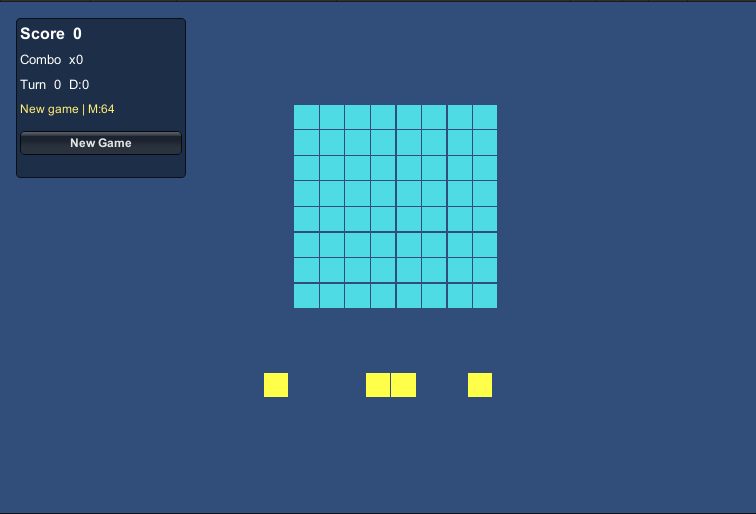
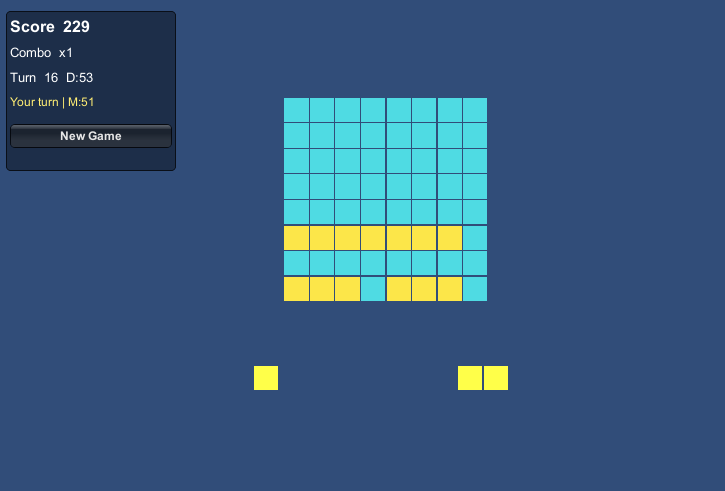
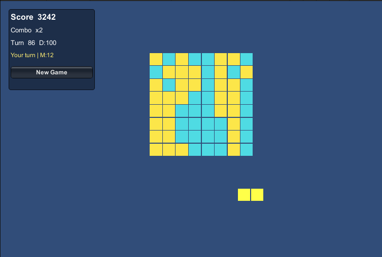
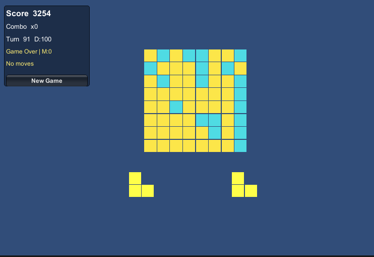

# Block Puzzle Game

Dự án game puzzle kiểu Block Blast được xây dựng bằng Unity, tập trung vào trải nghiệm kéo thả khối trên bàn cờ `8x8`, dọn hàng hoặc cột để ghi điểm và duy trì ván chơi lâu nhất có thể.

## Tính năng

- Kéo thả khối trực tiếp từ khay vào bàn cờ.
- Bàn cờ `8x8` đơn giản, dễ quan sát và dễ tính toán nước đi.
- Mỗi lượt cung cấp 3 khối để người chơi lựa chọn.
- Tự động xóa hàng hoặc cột khi được lấp đầy hoàn toàn.
- Hệ thống tính điểm theo số ô đã đặt, số line clear và combo liên tiếp.
- Preview vị trí đặt khối:
  - Xanh lá khi hợp lệ.
  - Đỏ khi không hợp lệ.
- Có ghost piece để người chơi nhìn trước vị trí snap khi kéo thả.
- Độ khó tăng dần theo điểm số, số lượt và độ đầy của bàn cờ.
- Tự động phát hiện `Game Over` khi không còn nước đi hợp lệ.
- Có nút `New Game` để bắt đầu lại nhanh.
- Tự động lưu và khôi phục ván chơi hiện tại.
- Có hiệu ứng phản hồi như flash khi clear line, rung khi đặt sai, hiển thị floating text và âm thanh đơn giản cho các hành động chính.

## Kiến trúc

Dự án được chia gọn thành 4 nhóm chính:

- `Core`: chứa logic bàn cờ, kiểm tra placement, phân tích trạng thái board.
- `Data`: chứa dữ liệu shape của các khối bằng `ScriptableObject`.
- `Gameplay`: điều phối vòng lặp game, spawn khối, kéo thả, tính điểm và save/load.
- `Presentation`: hiển thị bàn cờ, khối, HUD và phản hồi âm thanh/hình ảnh.

Luồng chính của game:

- `GameBootstrap` là trung tâm điều phối.
- `BoardState` giữ dữ liệu logic bàn cờ.
- `BoardView` hiển thị trạng thái board.
- `PieceDragHandler` xử lý kéo thả.
- `TrayController` quản lý 3 khối hiện tại.
- `SpawnDirector` quyết định bộ khối tiếp theo theo độ khó.

## Giao diện game

Giao diện game theo phong cách tối giản, rõ ràng và tập trung vào gameplay:

- Góc trái là bảng HUD hiển thị:
  - `Score`
  - `Combo`
  - `Turn`
  - chỉ số độ khó `D`
  - trạng thái hiện tại như `Your turn`, `Game Over`, `No moves`
- Ở giữa là bàn cờ `8x8` với các ô màu xanh cyan.
- Các ô đã được lấp sẽ chuyển sang màu vàng để phân biệt với ô trống.
- Phía dưới là khu vực chứa 3 khối hiện tại để người chơi kéo lên bàn cờ.
- Khi kéo khối:
  - game hiển thị preview vị trí đặt,
  - có ghost piece bán trong suốt,
  - giúp người chơi dễ căn vị trí hơn.
- Khi xóa hàng hoặc cột, bàn cờ có hiệu ứng nháy sáng nhẹ để tăng cảm giác phản hồi.
- Khi hết nước đi, HUD hiển thị trạng thái kết thúc ván và người chơi có thể bấm `New Game` để chơi lại.

### Hình minh họa

#### Màn hình khởi đầu

#### Trạng thái gameplay đầu trận

#### Trạng thái gameplay giữa trận

#### Trạng thái game over

